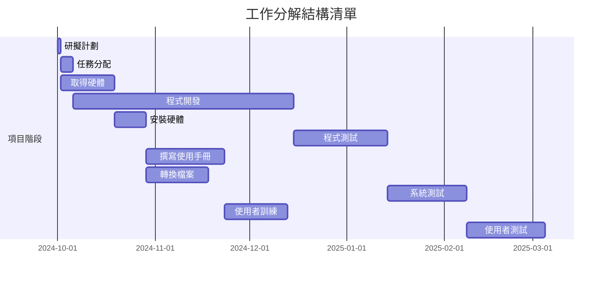
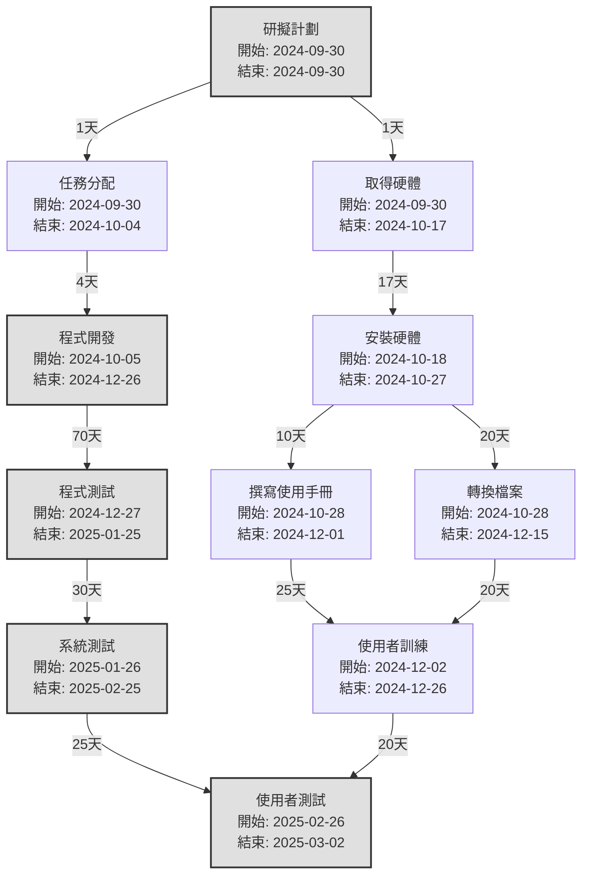

# hw2

**甘特圖**


**PERT/CPM 圖**

**關鍵路徑**
所有可能的路徑來找到最長的路徑
```mermaid
graph TD;
    A1[研擬計劃<br/>開始: 2024-09-30<br/>結束: 2024-09-30] -->|1天| A2[任務分配<br/>開始: 2024-10-01<br/>結束: 2024-10-04<br/>4天];
    A2 -->|70天| A4[程式開發<br/>開始: 2024-10-05<br/>結束: 2024-12-26<br/>70天];
    A4 -->|30天| A6[程式測試<br/>開始: 2024-12-27<br/>結束: 2025-01-25<br/>30天];
    A6 -->|25天| A9[系統測試<br/>開始: 2025-01-26<br/>結束: 2025-02-25<br/>25天];
    A9 -->|25天| A11[使用者測試<br/>開始: 2025-02-26<br/>結束: 2025-03-22<br/>25天];

    style A1 fill:#ffcccc,stroke:#333,stroke-width:2px;
    style A2 fill:#ffcccc,stroke:#333,stroke-width:2px;
    style A4 fill:#ffcccc,stroke:#333,stroke-width:2px;
    style A6 fill:#ffcccc,stroke:#333,stroke-width:2px;
    style A9 fill:#ffcccc,stroke:#333,stroke-width:2px;
    style A11 fill:#ffcccc,stroke:#333,stroke-width:2px;


